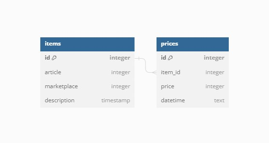

# Менеджер парсеров товаров
Этот проект представляет собой графический дизайн сделанный на PyQt5 для удобного парсинга цен товаров 
с различных площадок, а также их хранение и дальнейший анализ

Вы можете писать собственные парсеры для абсолютно любых площадок и подключать их к проекту, об этом написано ниже
## Технологии
- Python 3.11
- PyQt5 5.15
- pyqtgraph 0.13


## Диаграмма Базы Данных


# Установка 
## Создание виртуального окружения
### Для Linux
```
python3 -m venv venv
source venv/bin/activate
```
### Для Windows
```
python -m venv venv
venv\bin\activate
```

## Установка requirements
### Выберите один из файлов
Для работы проекта:
```
pip install -r requirements/prod.txt
```
Для разработки:
```
pip install -r requirements/dev.txt
```

# Запуск проекта
```
cd qt-parser
python main.py
```

# Создание собственных парсеров

Расположите ваш вайл парсера в папке `qt-parsers/parsers`

В файле `main.py` добавьте в список `parsers` картеж вида:

`(название_площадки_с_который_вы_получаете_данные, название_вашего_файла_парсера)`

Название вашей площадки в дальнейшем будет использоваться при добовлении нового товара
## В вашем парсере должны быть две обязательные функции: 
## `check_data`
Cлужит для проверки валидности введных пользователем данных при попытке добавить товар в базу данных.

Она принимает артикул товара и ничего не возвращает. 

Но при наличии в данных ошибок (несуществующий артикул, лишние символы), 
должна вызывать одну из ошибок в файле `exeptions.py`, лежащем рядом. 

В нем уже существуют два класса ошибок, и так же родительский класс, от которого, рекомендуется наследоваться, в случае
написания своих классов ошибок. Формулировка ошибок будет выводиться пользователю. 

### Написанние данной функции лежит на вашей ответсвенности, если вы уверенны в валидности вводимых вами данных, можете сделать ее пустой.

## `parsing_items`

Функция используется при получении всех цен товаров хранящихся в базе данных


Не принимает ничего на вход,
но возвращает список кортежей вида:

`(pk_(он же id)_товара, артикул_товара, предписание_пользователя, название_товара_полученное_при_парсинге, цена_товара)`

В случае отсутсвия данных цены при парсинге, вы можете присвоить цене товара строчное значение, тогда оно будет показано в таблице, 
но не будет сохранено в базу данных.

Стоит учесть, что артикул товара может быть строкой и вообще не обязательно должен быть артикулом, вы также можете там хранить ссылку на товар,
если будете ее коректно обрабатывать в этой функции и в `check_data`

### В качестве примера в проекте лежит парсер товаров с Wildberries, операйтесь на него при написаннии собственных

# Создание новой базы данных

В случае возникновения каких то проблем вы можете создать новую базу данных, так же у вас есть фиксутры для теста в папке `fixtures/items.json`

Команды для этого:

```
create table items
(
    id         INTEGER
        primary key autoincrement,
    article     TEXT not null,
    marketplace TEXT not null,
    description TEXT
);
```

```
create table prices
(
    id      INTEGER
        primary key autoincrement,
    item_id  INTEGER not null
        references items,
    price    INTEGER not null,
    datetime TEXT
);
```
